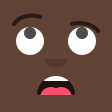

<h1 align="center"> <br />Avataaars Neutral</h1>
<p align="center">
  <strong>Avatar Style for <a href="https://dicebear.com/">DiceBear Avatars</a>.</strong><br />
    <a href="https://avataaars.com/">Avataaars</a>
    by Pablo Stanley
    licensed under
      <a href="https://avataaars.com/">Free for personal and commercial use.</a>.
</p>

<p align="center">
  While our code is MIT licensed, the design is licensed under
    <a href="https://avataaars.com/">Free for personal and commercial use.</a>.
  See <a href="https://dicebear.com/licenses">license overview</a> for more information.
</p>

----

## Usage

Install the DiceBear package and this Avatar styles with the following command.

```
npm install @dicebear/avatars @dicebear/avataaars-neutral --save
```

Now you are ready to create your first Avatar.

```js
import { createAvatar } from '@dicebear/avatars';
import * as style from '@dicebear/avataaars-neutral';

let svg = createAvatar(style, {
  seed: 'custom-seed',
  // ... and other options
});
```

## Options

All [options from DiceBear](https://avatars.dicebear.com/docs/options) and additionally the following:

### mouth

type: `array`  
allowed: `concerned`, `default`, `disbelief`, `eating`, `grimace`, `sad`, `screamOpen`, `serious`, `smile`, `tongue`, `twinkle`, `vomit`  
default: `['concerned', 'default', 'disbelief', 'eating', 'grimace', 'sad', 'screamOpen', 'serious', 'smile', 'tongue', 'twinkle', 'vomit']`


### nose

type: `array`  
allowed: `default`  
default: `['default']`


### eyes

type: `array`  
allowed: `closed`, `cry`, `default`, `eyeRoll`, `happy`, `hearts`, `side`, `squint`, `surprised`, `winkWacky`, `wink`, `xDizzy`  
default: `['closed', 'cry', 'default', 'eyeRoll', 'happy', 'hearts', 'side', 'squint', 'surprised', 'winkWacky', 'wink', 'xDizzy']`


### eyebrows

type: `array`  
allowed: `angryNatural`, `defaultNatural`, `flatNatural`, `frownNatural`, `raisedExcitedNatural`, `sadConcernedNatural`, `unibrowNatural`, `upDownNatural`, `angry`, `default`, `raisedExcited`, `sadConcerned`, `upDown`  
default: `['angryNatural', 'defaultNatural', 'flatNatural', 'frownNatural', 'raisedExcitedNatural', 'sadConcernedNatural', 'unibrowNatural', 'upDownNatural', 'angry', 'default', 'raisedExcited', 'sadConcerned', 'upDown']`


### backgroundColor

type: ``  
default: `['black', 'brown', 'darkBrown', 'light', 'pale']`


## Build this package

```
npm run build
```

## Test this package

```
npm run test
```
