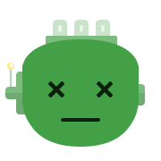

<h1 align="center"> <br />Bottts</h1>
<p align="center">
  <strong>Avatar Style for <a href="https://dicebear.com/">DiceBear</a>.</strong><br />
    <a href="https://bottts.com/">Bottts</a>
    by Pablo Stanley
    licensed under
      <a href="https://bottts.com/">Free for personal and commercial use</a>.
</p>

<p align="center">
  While our code is MIT licensed, the design is licensed under
    <a href="https://bottts.com/">Free for personal and commercial use</a>.
  See <a href="https://dicebear.com/licenses">license overview</a> for more information.
</p>

---

## Usage

### ESM

Install the DiceBear package and this avatar style with the following command:

```
npm install @dicebear/core@^5 @dicebear/bottts@^5 --save
```

Now you can create your first avatar.

```js
import { createAvatar } from '@dicebear/core';
import * as style from '@dicebear/bottts';

let svg = createAvatar(style, {
  // ... options
});
```

### CJS

Install the DiceBear package and this avatar style with the following command:

```
npm install @dicebear/core@^5 @dicebear/bottts@^5 --save
```

Now you can create your first avatar.

```js
const { createAvatar } = require('@dicebear/core');
const style = require('@dicebear/bottts');

let svg = createAvatar(style, {
  // ... options
});
```

### CDN

Paste the following code into the `head` of your document:

```html
<script src="https://unpkg.com/@dicebear/avatars@^5/dist/index.umd.js" crossorigin="anonymous" async></script>
<script src="https://unpkg.com/@dicebear/bottts@^5/dist/index.umd.js" crossorigin="anonymous" async></script>
```

Now you can create your first avatar.

```js
let svg = DiceBear.createAvatar(DiceBear., {
  // ... options
});
```

### HTTP-API

You can use this avatar style with the official API. For example, the URL can
look like this:

```
https://api.dicebear.com/5.x/bottts/custom-seed.svg
```

You can find the full documentation for the HTTP-API on the DiceBear homepage:  
https://dicebear.com/docs/http-api

### CLI

```
npx dicebear create bottts
```

You can find the full documentation for the CLI on the DiceBear homepage:  
https://dicebear.com/integrations/cli

## Options

All [options from DiceBear](https://dicebear.com/docs/options) and additionally
the following:

### baseColor

type: `array`  
default:
`['amber', 'blue', 'blueGrey', 'brown', 'cyan', 'deepOrange', 'deepPurple', 'green', 'grey', 'indigo', 'lightBlue', 'lightGreen', 'lime', 'orange', 'pink', 'purple', 'red', 'teal', 'yellow']`

### eyes

type: `array`  
allowed: `bulging`, `dizzy`, `eva`, `frame1`, `frame2`, `glow`, `happy`,
`hearts`, `robocop`, `round`, `roundFrame01`, `roundFrame02`, `sensor`,
`shade01`  
default:
`['bulging', 'dizzy', 'eva', 'frame1', 'frame2', 'glow', 'happy', 'hearts', 'robocop', 'round', 'roundFrame01', 'roundFrame02', 'sensor', 'shade01']`

### face

type: `array`  
allowed: `round01`, `round02`, `square01`, `square02`, `square03`, `square04`  
default:
`['round01', 'round02', 'square01', 'square02', 'square03', 'square04']`

### mouth

type: `array`  
allowed: `bite`, `diagram`, `grill01`, `grill02`, `grill03`, `smile01`,
`smile02`, `square01`, `square02`  
default:
`['bite', 'diagram', 'grill01', 'grill02', 'grill03', 'smile01', 'smile02', 'square01', 'square02']`

### sides

type: `array`  
allowed: `antenna01`, `antenna02`, `cables01`, `cables02`, `round`, `square`,
`squareAssymetric`  
default:
`['antenna01', 'antenna02', 'cables01', 'cables02', 'round', 'square', 'squareAssymetric']`

### sidesProbability

type: `integer`  
minimum: `0`  
maximum: `100`  
default: `100`

### texture

type: `array`  
allowed: `camo01`, `camo02`, `circuits`, `dirty01`, `dirty02`, `dots`,
`grunge01`, `grunge02`  
default:
`['camo01', 'camo02', 'circuits', 'dirty01', 'dirty02', 'dots', 'grunge01', 'grunge02']`

### textureProbability

type: `integer`  
minimum: `0`  
maximum: `100`  
default: `50`

### top

type: `array`  
allowed: `antenna`, `antennaCrooked`, `bulb01`, `glowingBulb01`,
`glowingBulb02`, `horns`, `lights`, `pyramid`, `radar`  
default:
`['antenna', 'antennaCrooked', 'bulb01', 'glowingBulb01', 'glowingBulb02', 'horns', 'lights', 'pyramid', 'radar']`

### topProbability

type: `integer`  
minimum: `0`  
maximum: `100`  
default: `100`

## Build this package

```
npm run build
```

## Test this package

```
npm run test
```
